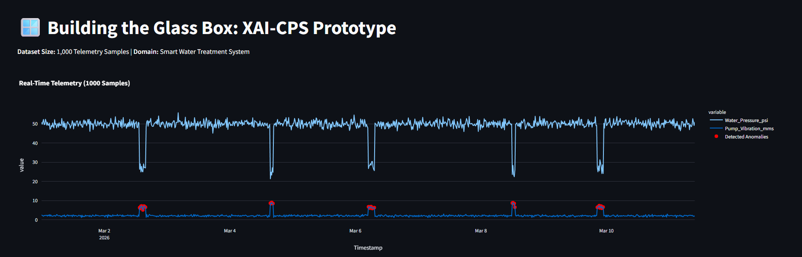
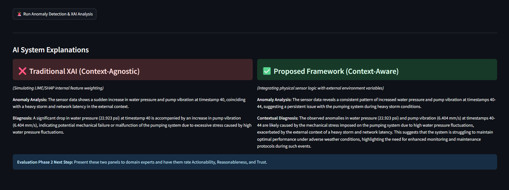

# 🪟 Building the Glass Box: A Human-Centered Framework for Explainable AI in Cyber-Physical Systems

[](https://www.python.org/downloads/)
[](https://streamlit.io/)
[](https://ollama.ai/)
[](https://microsoft.github.io/autogen/)

## 📖 Overview
The integration of Artificial Intelligence (AI) and Cyber-Physical Systems (CPS) is driving a new industrial transformation. However, the "black box" nature of high-performance AI models creates catastrophic risks in safety-critical systems. 

This repository contains the empirical implementation and research report for our B.Tech project. It addresses a critical failure in current Explainable AI (XAI) methods—a **lack of context-awareness**—by proposing and implementing a novel, human-centered methodological framework. 

We transition from theoretical design to a functional "Glass Box" software prototype, simulating a Smart Water Treatment System to demonstrate how context-aware AI outperforms traditional context-agnostic models.

## ✨ Key Features
* **Multi-Agent Architecture:** Utilizes Microsoft AutoGen to orchestrate multiple AI agents (a CPS Monitor and an XAI Explainer) to analyze sensor telemetry autonomously.
* **100% Local & Secure Data Processing:** Addresses the privacy and cybersecurity vulnerabilities of cloud APIs by running **Llama 3.2** entirely offline via Ollama.
* **Context-Aware Explanations:** Correlates internal physical sensor deviations (e.g., pressure drops, vibration spikes) with external environmental contexts (e.g., weather, network latency).
* **Human-Centered Dashboard:** A Streamlit-based interface that contrasts traditional XAI outputs directly against our proposed context-aware framework for objective human evaluation.

## 📂 Repository Structure
* `/code/` - Contains the Python scripts for the Streamlit dashboard and AutoGen multi-agent system (`app.py`).
* `/report/` - Contains the compiled 8th-semester project PDF (`TW_Project_Report_new.pdf`).
* `/assets/` - Contains dashboard screenshots, output images, and architectural diagrams used in the evaluation phase.

## 📸 Dashboard & Outputs

*(Note: Replace the file paths below with the actual paths in your GitHub `/assets/` folder)*

### The "Glass Box" Interface

*Real-time CPS sensor telemetry visualization showing normal operations and injected anomaly windows.*

### XAI Comparison: Context-Agnostic vs. Context-Aware

*The multi-agent system successfully identifies that the pump vibration is caused by storm-induced network latency, whereas traditional XAI incorrectly diagnoses an imminent mechanical failure.*

## 🚀 Getting Started (Running Locally)

### Prerequisites
1. Install [Python 3.9+](https://www.python.org/downloads/).
2. Install [Ollama](https://ollama.com/) and download the Llama 3.2 model:
   ```bash
   ollama run llama3.2
   ```
### Installation
1. Clone the repository:
   ```bash
   git clone [https://github.com/yourusername/glass-box-xai-cps.git](https://github.com/yourusername/glass-box-xai-cps.git)
   cd glass-box-xai-cps
   ```
2. Install the required dependencies:
   ```bash
   pip install streamlit pandas plotly ag2[openai]
   ```

### Execution
1. Ensure the Ollama application is running in the background.
2. Launch the Streamlit dashboard:
   ```bash
   streamlit run code/app.py
   ```
3. Open the provided local URL (usually ```http://localhost:8501```) in your browser. Click the "🚨 Run Anomaly Detection & XAI Analysis" button to trigger the local Llama 3.2 multi-agent analysis.

## 📊 Phase 2: Human-Centered Evaluation
As part of this framework, the prototype's outputs were subjected to a human-centered evaluation using a 5-point Likert scale. Domain experts evaluated the contrasting explanations based on:
1. **Reasonableness**
2. **Trust**
3. **Actionability**

Our empirical data demonstrates that context-aware explanations significantly increase user trust and operational actionability in simulated industrial crises.

## 👥 Authors & Acknowledgements
### Researchers
* Subhranshu Panda (Dept. of Computer Science Engineering, IIIT Bhubaneswar)
* Shreyansh Gupta (Dept. of Computer Science Engineering, IIIT Bhubaneswar)

### Project Guide:
* Prof. Bharati Mishra (IIIT Bhubaneswar)

This project was completed in partial fulfillment of the requirements for the degree of Bachelor of Technology in Computer Science Engineering.

***

