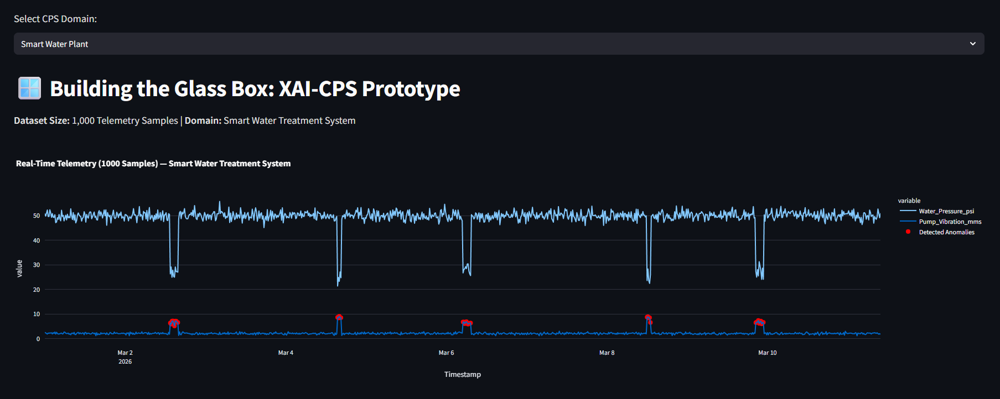
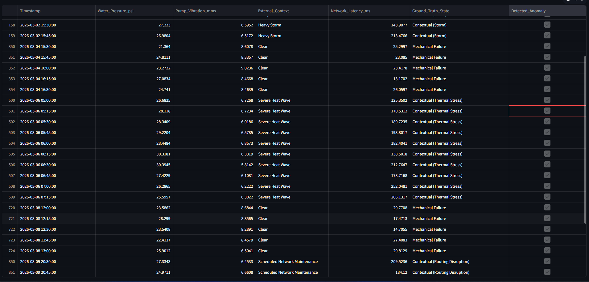
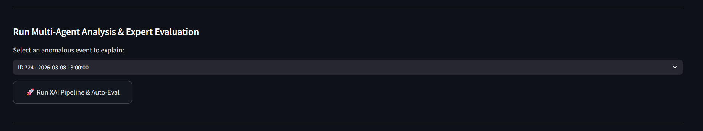
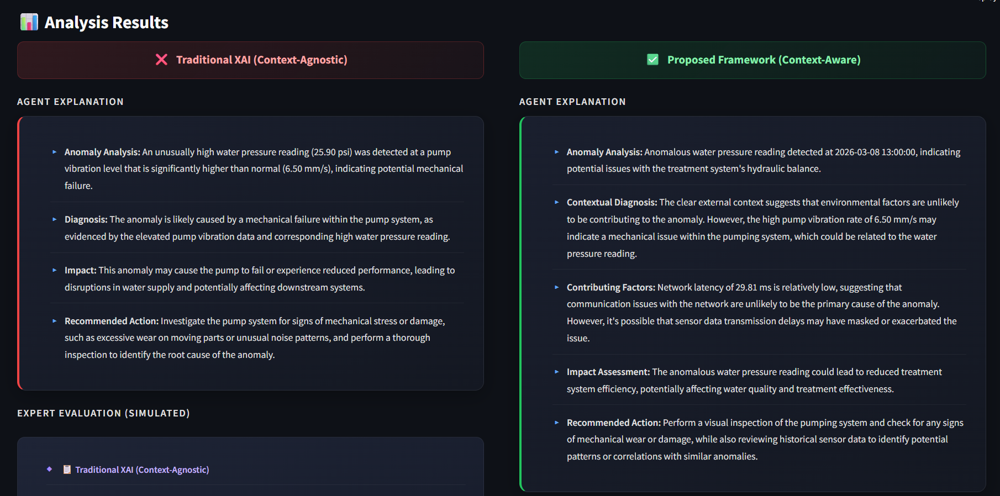
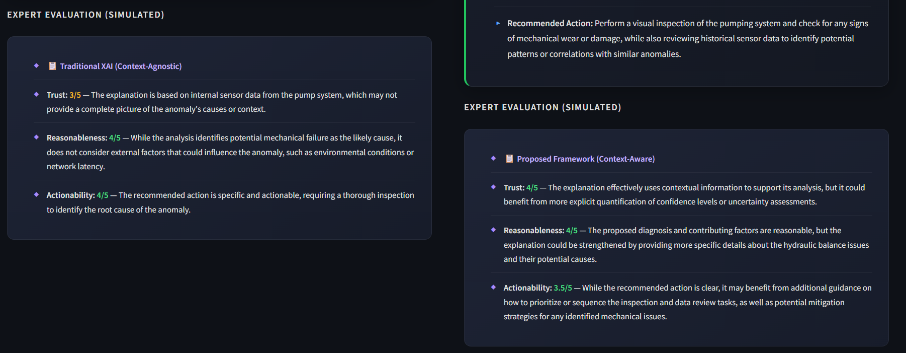
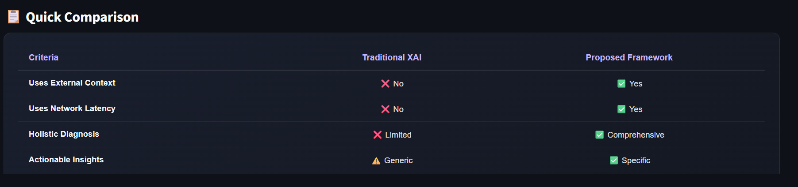

# 🪟 Building the Glass Box: A Human-Centered Framework for Explainable AI in Cyber-Physical Systems

[](https://www.python.org/downloads/)
[](https://streamlit.io/)
[](https://ollama.ai/)
[](https://microsoft.github.io/autogen/)

## 📖 Overview
The integration of Artificial Intelligence (AI) and Cyber-Physical Systems (CPS) is driving a new industrial transformation. However, the "black box" nature of high-performance AI models creates catastrophic risks in safety-critical systems. 

This repository contains the empirical implementation and research report for our B.Tech project. It addresses a critical failure in current Explainable AI (XAI) methods—a **lack of context-awareness**—by proposing and implementing a novel, human-centered methodological framework. 

We transition from theoretical design to a functional "Glass Box" software prototype. To prove scalability, the system is evaluated on robust, synthesized datasets of **1,000 time-series samples** across multiple domains (a **Smart Water Treatment System** and a **Smart Power Grid**), demonstrating how context-aware AI outperforms traditional context-agnostic models in real-world pipelines.

## ✨ Key Features
* **Multi-Domain Simulation & Hybrid Pipeline:** Replicates real-world industrial pipelines for both Smart Water and Power Grid systems by applying algorithmic anomaly detection across 1,000-sample datasets, followed by dynamic LLM-based explanations.
* **Advanced Multi-Agent Architecture:** Utilizes Microsoft AutoGen to orchestrate multiple AI agents—including specialized **XAI Explainers** and **Expert Evaluators** (LLM-as-a-judge)—to autonomously analyze sensor telemetry and score explanations.
* **100% Local & Secure Data Processing:** Addresses the privacy and cybersecurity vulnerabilities of cloud APIs by running **Llama 3.2** entirely offline via Ollama.
* **Context-Aware Explanations:** Correlates internal physical sensor deviations (e.g., pressure drops, voltage sags) with external environmental contexts (e.g., storms, extreme heat waves, network latency).
* **Premium Human-Centered Dashboard:** A completely revamped Streamlit interface featuring a dynamic domain selector, modern "Glass Box" aesthetics, side-by-side comparative analysis, and structured evaluation scorecards.

## 📂 Repository Structure
* `/code/` - Contains the Python scripts:
  * `app.py`: The Streamlit dashboard, domain selector, and AutoGen multi-agent system (Explainers and Evaluators).
  * `generate_dataset.py`: Generates the 1,000-sample Smart Water telemetry dataset.
  * `generate_powergrid_dataset.py`: Generates the 1,000-sample Smart Power Grid telemetry dataset.
* `/report/` - Contains the compiled 8th-semester project PDF (`TW_Project_Report_new.pdf`).
* `/assets/` - Contains dashboard screenshots, output images, and architectural diagrams used in the evaluation phase.

## 📸 Dashboard & Outputs

<!-- USER INSTRUCTION: ADD YOUR DASHBOARD SCREENSHOTS BELOW -->

### 1. The "Glass Box" Interface & Domain Selector
[//]: # (ADD SCREENSHOT HERE: Showing the top part of the dashboard, Domain Selector, and the interactive telemetry graph)



*Real-time CPS sensor telemetry visualization with the ability to switch between Smart Water and Power Grid domains, dynamically highlighting detected anomalies.*

### 2. Multi-Agent Analysis & Structured Explanations
[//]: # (ADD SCREENSHOT HERE: Showing the side-by-side Result Cards for Traditional XAI vs. Proposed Framework)

*The multi-agent system generates structured, bulleted diagnoses. The Context-Aware model successfully links internal failures (e.g., voltage sags) to external events, unlike the Context-Agnostic model.*

### 3. Automated Expert Evaluation & Comparison
[//]: # (ADD SCREENSHOT HERE: Showing the Agent Evaluation Scorecards and the Quick Comparison Table at the bottom)


*An Expert Evaluator agent automatically scores both explanations out of 5 across Trust, Reasonableness, and Actionability, summarized in a Quick Comparison Table.*

## 🚀 Getting Started (Running Locally)

### Prerequisites
1. Install [Python 3.9+](https://www.python.org/downloads/).
2. Install [Ollama](https://ollama.com/) and download the Llama 3.2 model:
   
   ```bash
   ollama run llama3.2
   ```
### Installation
1. Clone the repository:
   
   ```bash
   git clone [https://github.com/yourusername/glass-box-xai-cps.git](https://github.com/yourusername/glass-box-xai-cps.git)
   cd glass-box-xai-cps
   ```
   
3. Install the required dependencies:
   
   ```bash
   pip install streamlit pandas plotly ag2[openai]
   ```

### Execution

1. **Generate The Datasets** : First synthesize the 1000-sample telemetry datasets by running the generation scripts:
   ```bash
   python code/generate_dataset.py
   python code/generate_powergrid_dataset.py
   ```
2. Ensure the Ollama application is running in the background.
3. Launch the Streamlit dashboard:
   
   ```bash
   streamlit run code/app.py
   ```
   
4. Open the provided local URL (usually ```http://localhost:8501```) in your browser. Click the "🚨 Run Anomaly Detection & XAI Analysis" button to trigger the local Llama 3.2 multi-agent analysis.

## 📊 Phase 2: Multi-Agent Automated Evaluation
As part of this framework, we have upgraded our manual human evaluation process into a sophisticated **LLM-as-a-Judge** pipeline. A designated **Expert Evaluator Agent** (configured with domain-specific personas like Senior Grid Operations Engineer) automatically grades the contrasting explanations in real-time.

The evaluation utilizes a 5-point scale based on:
1. **Reasonableness**
2. **Trust**
3. **Actionability**

The dashboard instantly displays these scorecards and justifications alongside a Quick Comparison Table, demonstrating that context-aware explanations consistently achieve higher trust and actionability scores.

## 👥 Authors & Acknowledgements
### Researchers
* Subhranshu Panda (Dept. of Computer Science Engineering, IIIT Bhubaneswar)
* Shreyansh Gupta (Dept. of Computer Science Engineering, IIIT Bhubaneswar)

### Project Guide:
* Prof. Bharati Mishra (IIIT Bhubaneswar)

This project was completed in partial fulfillment of the requirements for the degree of Bachelor of Technology in Computer Science Engineering.

***

